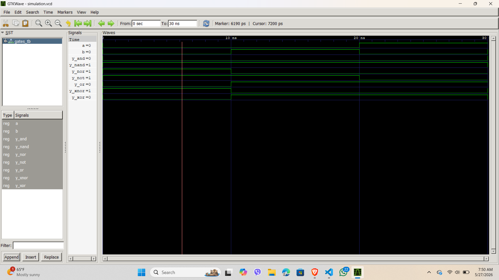

Lab 2:

VHDL Code for Realizing Logic Gates

Objective

• To write VHDL code for basic logic gates: AND, OR, NOT, NAND, NOR, XOR, and XNOR.

 • To simulate each gate and verify its truth table using GTKWave.

Theory

Logic gates are the fundamental building blocks of all digital circuits. Each gate performs a basic Boolean operation on one or more binary inputs to produce a single binary output.

Gate VHDL Operator Boolean Expression

AND and Y = A · B

OR or Y = A + B

NOT not Y = bar(A)

NAND nand Y = bar(A · B)

NOR nor Y = bar(A + B)

XOR xor Y = bar(A ⊕ B)

XNOR xnor Y = bar(A ⊕ B)

OUTPUT:

Discussion and Conclusion

From the output waveform observed in GTKWave, we can see the expected results for all logic gates represented in the form of signals.

During the first 10 ns, both inputs are low (a = 0, b = 0).
During the next 10 ns (10 ns to 20 ns), the inputs are a = 1 and b = 0.
During the following 10 ns (20 ns to 30 ns), the inputs become a = 0 and b = 1.
Finally, after 30 ns, both inputs are high (a = 1, b = 1).

The corresponding outputs of the logic gates are displayed below the input signals a and b, confirming the expected behavior of each logic gate.

