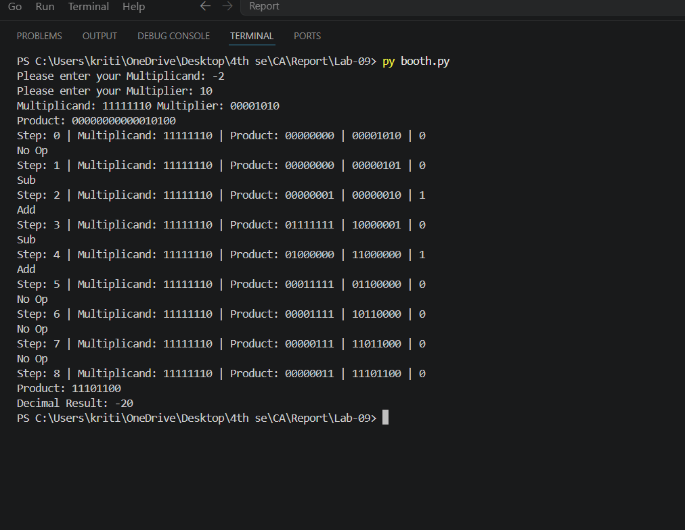

# Lab 9: Program to Implement the Booth Algorithm

## Objective

- To understand the Booth multiplication algorithm for signed binary numbers.
- To implement the Booth algorithm and verify it with test cases.

---

# Theory

The **Booth Algorithm** (1951) is an efficient method for multiplying two signed integers in **two's complement representation**. It reduces the number of addition and subtraction operations by exploiting runs of consecutive **1s** and **0s** in the multiplier. This makes it more efficient than the standard binary multiplication method, especially for signed numbers.

---

# Algorithm

Given multiplicand **M** and multiplier **Q**, both of **n** bits:

### Step 1: Initialization

- Accumulator **A = 0**
- **Q₋₁ = 0**
- **Step Count = n**

---

### Step 2: Examine the Last Bit of Q (Q₀) and Q₋₁

| Q₀ | Q₋₁ | Operation |
|:--:|:---:|-----------|
| 0 | 0 | No operation (Shift only) |
| 0 | 1 | A = A + M |
| 1 | 0 | A = A − M |
| 1 | 1 | No operation (Shift only) |

---

### Step 3: Arithmetic Right Shift

Shift the combined register **[A, Q, Q₋₁]** by **one bit to the right** while preserving the sign bit.

---

### Step 4: Repeat

Repeat **Steps 2 and 3** for **n cycles**.

---

### Step 5: Result

The final multiplication result is stored in the combined register:

**[A, Q]**

---
## Output

## Discussion and Conclusion

The Booth algorithm was successfully implemented and 
verified using Python. The program correctly 
multiplied signed binary numbers using two's 
complement representation, and the output matched 
the expected results. This experiment helped in 
understanding the working of the Booth 
multiplication algorithm and achieved the objective 
of the lab.
