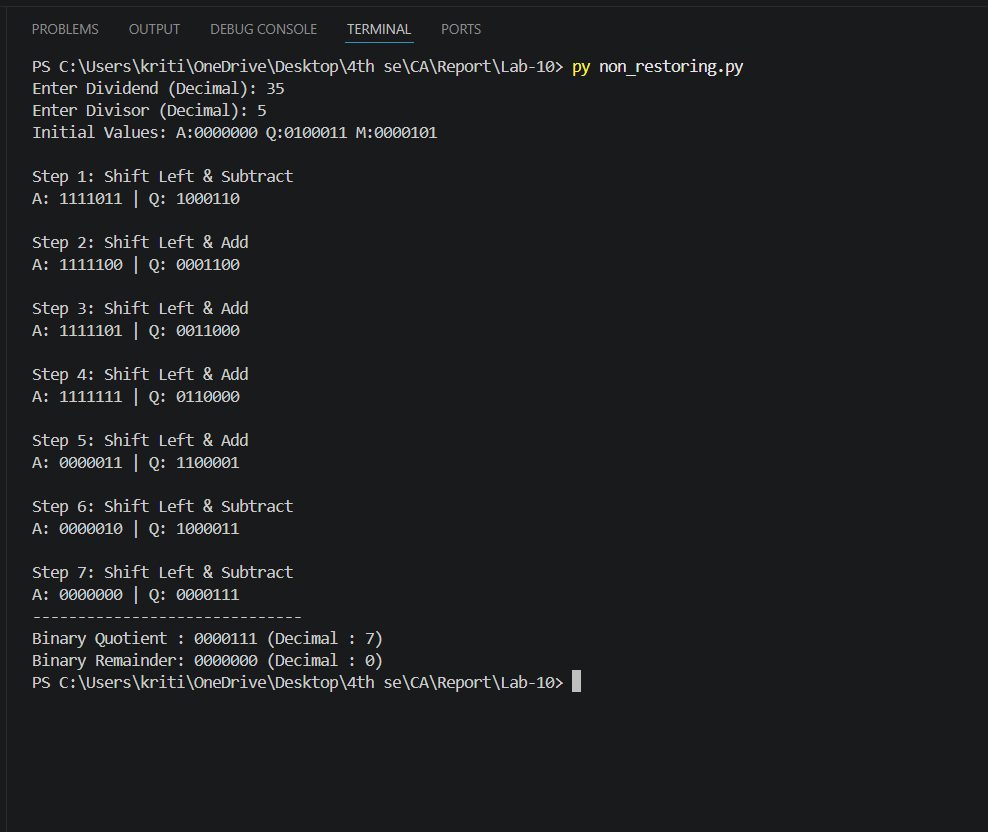

# Lab 10: Program to Implement the Non-Restoring Division Algorithm

## Objective

- To understand the Non-Restoring Division Algorithm for unsigned binary numbers.
- To implement the algorithm in Python and verify it with test cases.

---

## Theory

The **Non-Restoring Division Algorithm** is an efficient method for dividing unsigned binary numbers. Unlike the restoring division algorithm, it avoids the restoration step when the partial remainder becomes negative. Instead, the sign of the partial remainder determines whether the next operation is an addition or subtraction. This reduces the number of operations and improves the efficiency of binary division.

---

## Algorithm

Given **Dividend (Q)** and **Divisor (M)**, both of **n** bits:

### Step 1: Initialization

- Set **A = 0** (Partial Remainder)
- Load the dividend into the **Q** register.
- Load the divisor into the **M** register.

---

### Step 2: Repeat for n Steps

1. Left-shift the combined register **[A, Q]** by one bit.
2. If **A ≥ 0**, perform:
   ```
   A = A − M
   ```
3. If **A < 0**, perform:
   ```
   A = A + M
   ```
4. Update the least significant bit of **Q**:
   - If **A ≥ 0**, set **Q₀ = 1**
   - If **A < 0**, set **Q₀ = 0**

---

### Step 3: Final Correction

If **A < 0**, perform:

```
A = A + M
```

---

## Result

- **Quotient** is stored in **Q**.
- **Remainder** is stored in **A**.

## OutPut


## Discussion and Conclusion

The Non-Restoring Division Algorithm was 
successfully implemented in Python. The program 
correctly calculated the quotient and remainder, and
\ the results matched the expected output. Thus, the
 objective of the experiment was successfully 
 achieved.
 